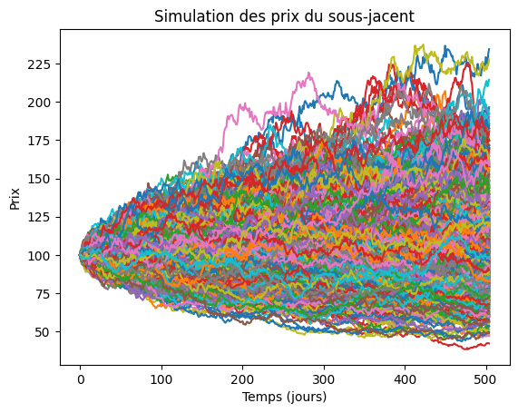
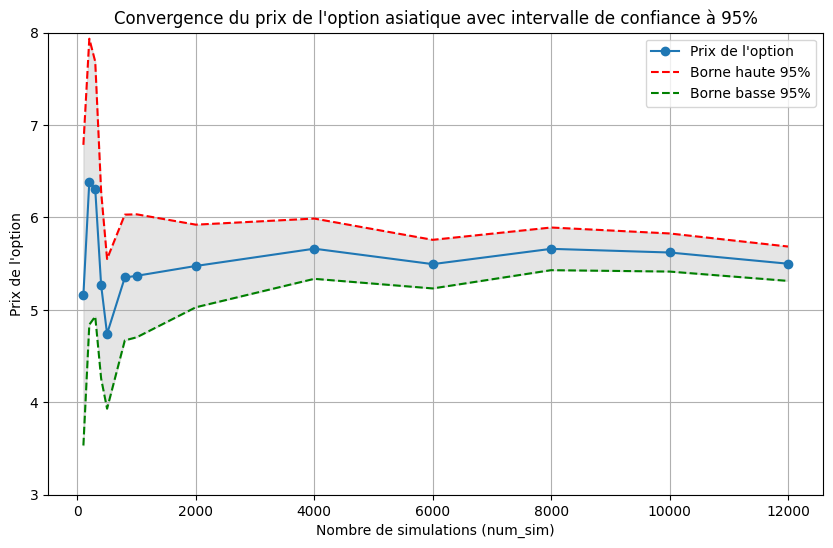
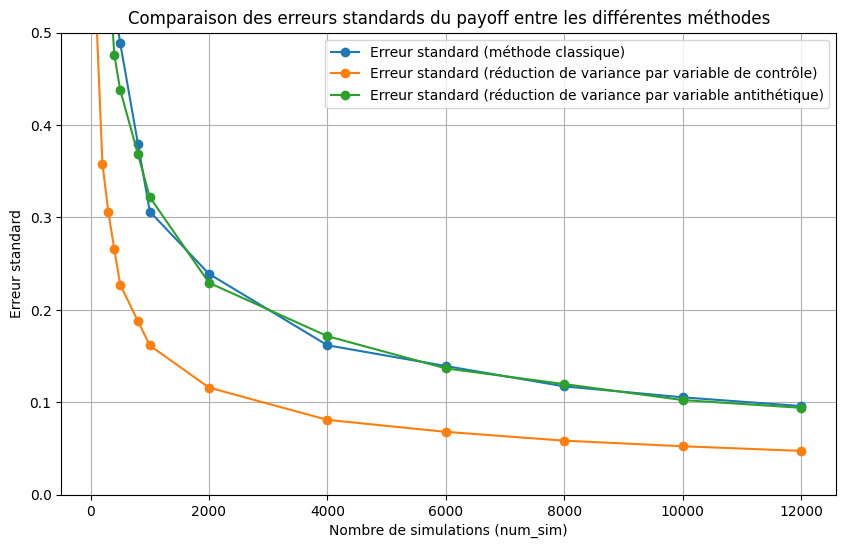

# Pricer d'option asiatique

Ce projet implémente le pricing d'une **option asiatique à moyenne arithmétique** sous le modèle de **Black-Scholes**, en utilisant la **méthode de Monte Carlo**.

Le notebook contient :
- La simulation de trajectoires de prix.
- Le prix de l'option, son payoff moyen et le profit en fonction du prix du sous-jacent au temps $0$.
- L’analyse de convergence selon le nombre de simulations.
- Des techniques de réduction de variance pour améliorer la précision.

##  Objectif

Estimer numériquement le prix d’une option asiatique dans un marché sans arbitrage, et comparer différentes méthodes d’optimisation numérique.

##  Méthodologie

- Hypothèses du modèle de Black-Scholes
- Génération de trajectoires via un mouvement brownien géométrique
- Calcul du payoff moyen et actualisé
- Réduction de la variance : 
  - Variables antithétiques
  - Variable de contrôle

##  Technologies utilisées

- Python 3
- NumPy
- Matplotlib
- Jupyter Notebook

##  Structure

- `README.md` : Ce fichier
- `option_asiatique_pricer.ipynb` : Notebook principal avec le code et les résultats

## Equations

- **Prix du sous-jacent** : $$S_t = S_0 e^{(r - \frac{\sigma^2}{2})t + \sigma W(t)}$$
- **Payoff du call asiatique à moyenne arithmétique type Average Price** : $$C = \max\left(\frac{1}{n} \sum_{i=1}^n S_{t_i} - K, 0\right)$$
- **Payoff du call asiatique à moyenne arithmétique type Average Strike** : $$C = \max\left(S_{T} - \frac{1}{n} \sum_{i=1}^n S_{t_i}, 0\right)$$
- **Prix de l'option asiatique type Average Price** : $$V = e^{-rT} \mathbb{E}\left[\max\left(\frac{1}{n} \sum_{i=1}^n S_{t_i} - K, 0\right)\right]$$

## Graphiques

 

  

  

  

  

 

